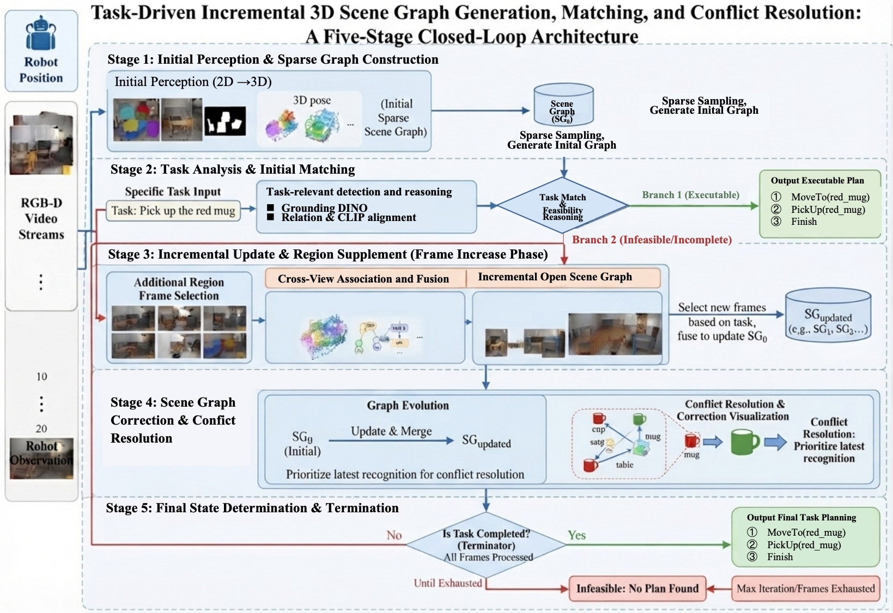
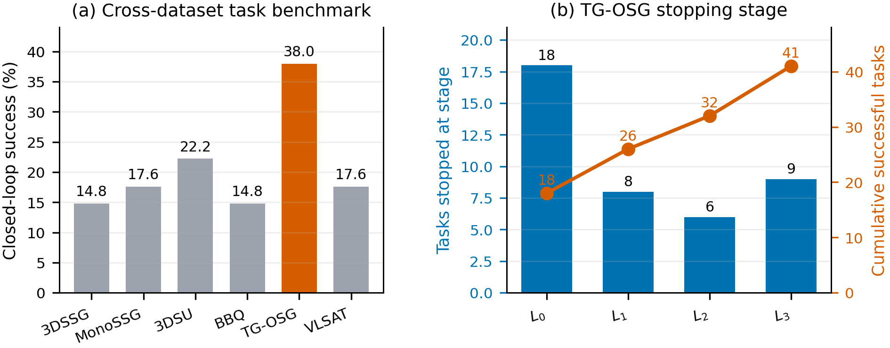
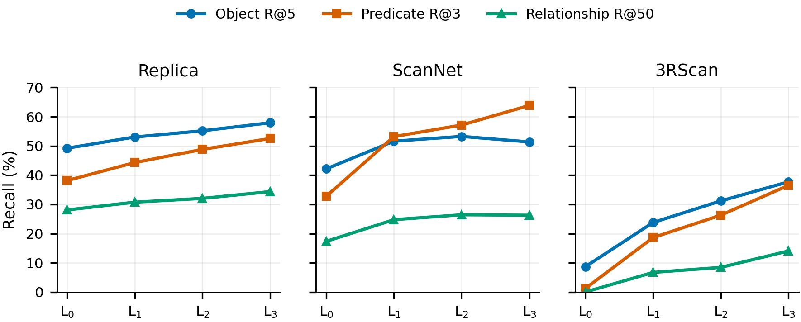
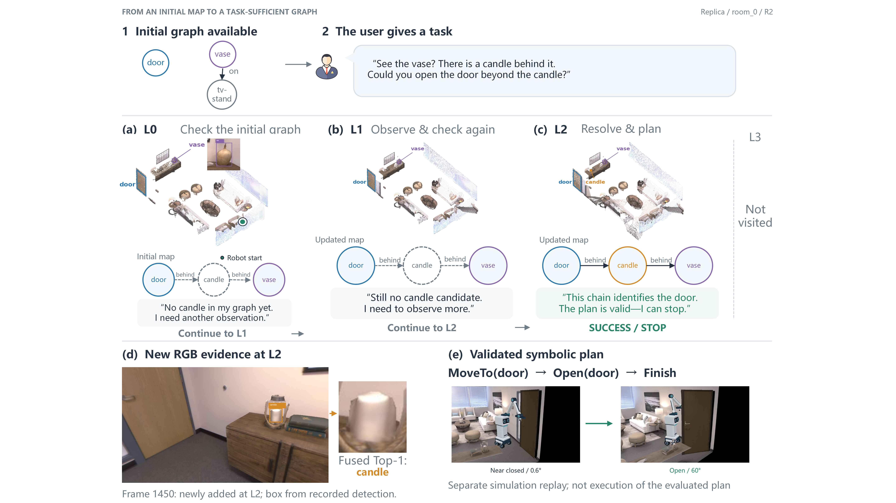
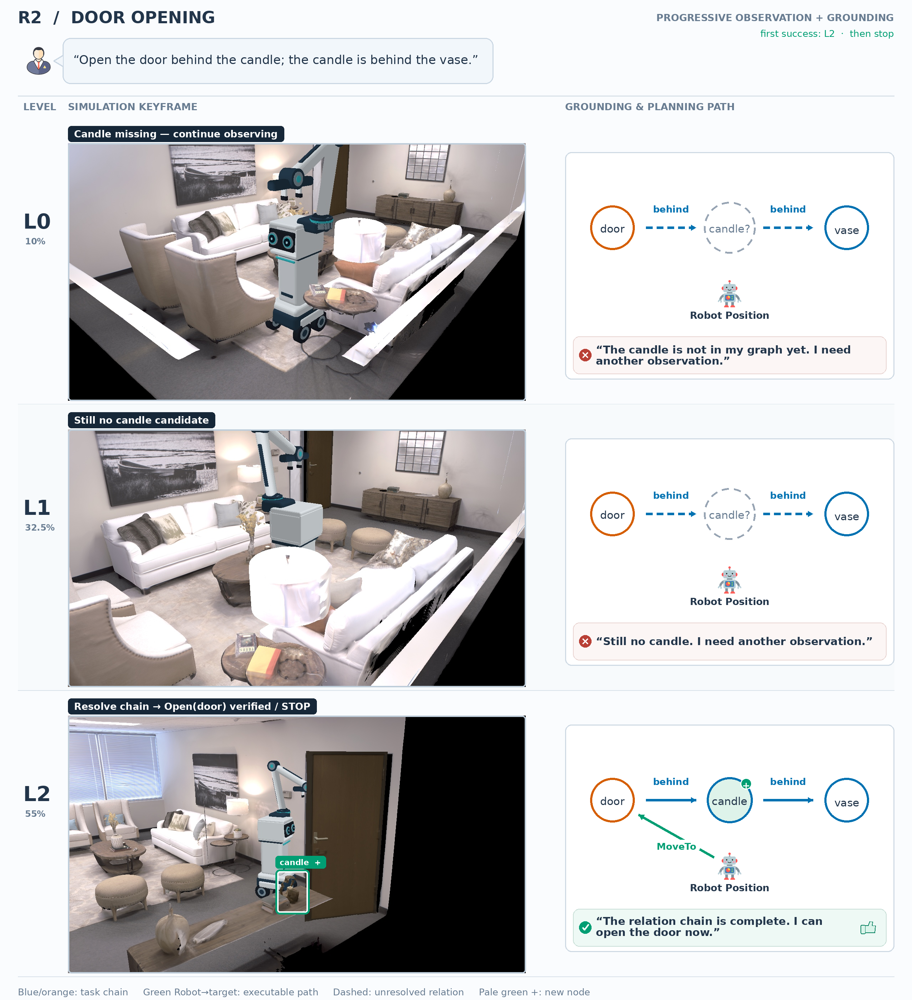

# Task-Grounded Open-Vocabulary 3D Scene Graph Incremental Generation for Task Planning

### TG-OSG: build only the part of a 3D scene graph that a robot needs to solve its current task

**Open-vocabulary 3D scene graphs · Incremental perception · Task grounding · Symbolic planning**

[Overview](#overview) · [Method](#method) · [Results](#main-results) · [Qualitative Results](#qualitative-results) · [Citation](#citation)

> **Release status.** This repository is being prepared for the public research release. Paper and code links will be added when they become available.

## Overview

Robotic task planning is usually local: a task depends on a small subset of the objects, relations, and states in a scene. Existing 3D scene graph pipelines instead process all observations and attempt to reconstruct the entire scene before the task is known. This exhaustive strategy is expensive and can amplify back-projection, registration, and instance-association errors.

**TG-OSG** treats scene understanding as a task-triggered, closed-loop process. It starts from a coarse open-vocabulary 3D scene graph, grounds the requested task, and acquires additional observations only when the current graph is insufficient. The loop terminates as soon as it finds a valid executable plan or exhausts the observation budget.

  

<em>Overview of TG-OSG. A sparse initial graph is incrementally expanded, associated across views, and checked against task requirements in a closed loop.</em>

### Highlights

- **Task-grounded perception.** Observation is driven by missing task evidence instead of exhaustive scene reconstruction.
- **Persistent open graph.** Newly observed entities and relations are merged across stages while object identities and earlier task context are preserved.
- **Early task-level termination.** The system stops observing once the current graph uniquely grounds the task and supports a valid symbolic plan.
- **Cross-dataset evaluation.** Experiments cover Replica, ScanNet, and 3RScan, together with simulated tasks at three relation-depth levels.

## Abstract

For a robot operating in an indoor 3D scene, a planning task is inherently local: it is defined over a small subset of entities, relations, and states that the goal depends on, rather than over the scene as a whole. Robotic task planning therefore demands task-grounded, on-demand scene understanding—yet existing 3D scene graph pipelines do the opposite, consuming all frames and exhaustively enumerating objects and relations before any task is known, on a closed scene graph with predefined categories and structure. This global, task-agnostic construction is mismatched to planning: in the 2D-to-3D reconstruction process, more frames accumulate larger back-projection and registration errors, which instead amplify object recognition bias; pose drift corrupts the association of small interaction elements; and computation is wasted on task-irrelevant regions.

We propose **Task-Grounded 3D Open Scene Graph Incremental Generation (TG-OSG)**, which reframes the scene graph into an open representation generated on demand. TG-OSG (1) builds a coarse open scene graph from a few dominant-viewpoint frames, (2) incrementally refines it by acquiring additional frames only for task-relevant regions and discovering novel entities and relations, and (3) terminates once the task is determined to be executable—yielding an execution sequence—or infeasible. We evaluate on three public 3D scene graph datasets together with a self-built simulation for task-grounded scene graph generation, and demonstrate significant improvements over existing closed and open scene graph generation methods on both open scene graph generation and the corresponding task planning.

## Method

TG-OSG runs a dynamic perception–planning loop:

1. **Initialize.** Pose-aware farthest-point sampling selects a compact set of RGB-D observations and constructs a coarse open-vocabulary graph.
2. **Ground and plan.** The task interpreter identifies the required entities, relations, and states; a symbolic planner tests whether the current graph is sufficient.
3. **Observe and update.** If evidence is missing, TG-OSG activates the next observation stage, fuses new open-vocabulary detections, and updates persistent object identities and relations.
4. **Stop.** The loop returns an executable plan at the first successful stage, or reports the task unresolved after the maximum budget.

This design makes **task solvability**, rather than a fixed reconstruction budget, determine how far the scene representation grows.

## Main Results

### Task planning and observation efficiency

  

TG-OSG reaches a **37.96% closed-loop task success rate**, compared with **22.22%** for the strongest baseline (3DSU): an absolute gain of **15.74 percentage points** and a relative improvement of **70.83%**.

Among successful tasks, **78.05% terminate before the full observation budget**, and the mean successful-task budget is only **40.73%** of the maximum. Dynamic closed-loop evaluation also improves task success from **33.33%** at a fixed full budget to **37.96%**, because valid earlier solutions are preserved before additional reconstruction errors accumulate.

### Open-vocabulary 3D scene graph generation

  

Scene graph quality generally improves as task-triggered observations are added from stage \(L_0\) to \(L_3\). At the full budget, TG-OSG ranks first on all six macro-averaged metrics and in 16 of the 18 dataset–metric combinations.

| Method | Object R@1 | Object R@5 | Object R@10 | Predicate R@3 | Predicate R@5 | Relationship R@50 |
|:--|--:|--:|--:|--:|--:|--:|
| 3DSU | 17.61 | 35.83 | 41.22 | 34.06 | 38.55 | 12.44 |
| BBQ | 15.02 | 33.94 | 39.52 | 35.30 | 40.69 | 10.90 |
| **TG-OSG** | **26.33** | **49.00** | **55.48** | **50.97** | **58.09** | **24.91** |

<em>Macro-average recall (%) over Replica, ScanNet, and 3RScan in the open setting at the full observation budget. Predicate and relationship metrics use joint scoring.</em>

In particular, TG-OSG achieves **24.91% Relationship R@50**, approximately **2×** the strongest baseline. Because this metric requires both relation endpoints and the predicate to be correct, it directly reflects the improved relational structures available to the downstream planner.

## Qualitative Results

### Closed-loop graph completion

  

Given a door-opening task, the initial graph contains the door and vase but lacks the candle needed to complete the relational constraint chain. TG-OSG checks the current graph at each stage, acquires new evidence only while the task remains unresolved, and discovers the missing candle at \(L_2\). The completed chain uniquely identifies the target door, validates the symbolic plan, and prevents the unnecessary \(L_3\) observation stage.

### Simulated task example

  

For the instruction *“Open the door behind the candle; the candle is behind the vase,”* the initial graph cannot resolve the complete relation chain. TG-OSG continues observing until the missing candle is discovered at \(L_2\), grounds the door unambiguously, produces the action path, and stops without consuming the final stage.

## Evaluation Protocol

- **Datasets:** Replica, ScanNet, and 3RScan.
- **Tasks:** five task types with R1–R3 relational depth.
- **Task metric:** closed-loop success at the first stage with a valid grounding and symbolic plan.
- **Scene graph metrics:** Object R@1/5/10, Predicate R@3/5, and Relationship R@50.
- **Baselines:** 3DSSG, MonoSSG, 3DSU, BBQ, and VLSAT for task planning; 3DSU and BBQ for open-setting point-cloud scene graph generation.
- **Controlled comparison:** every predicted graph is connected to the same task interpreter and symbolic planner.

Functional-task success means that the symbolic action sequence passes state-transition and goal checks. Physical navigation and manipulation execution are outside the scope of the reported task-success metric.

